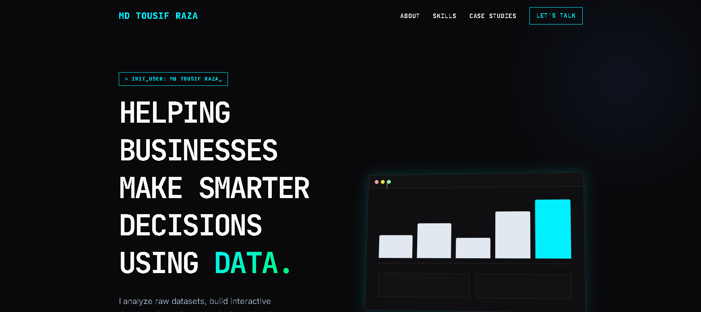

# 🌐 Md Tousif Raza — Data Analyst Portfolio

---

## 🌐 Portfolio Preview

---

## 🚀 Live Portfolio

👉 **[View Website](https://mdtousifrazaofficial.github.io)**
---

## 👨‍💻 About Me

I am a Data Analyst focused on transforming raw data into actionable insights that drive business decisions.  
I specialize in SQL, Excel, Power BI, and Python to analyze datasets, build dashboards, and uncover meaningful trends.

---

## 📊 Featured Projects

### 🔹 Zomato Data Analysis
- Analyzed restaurant data to identify performance trends and customer behavior  
- Used SQL for data cleaning and querying  
- Built dashboards to visualize key insights  
- **Impact:** Identified top-performing restaurants and key factors affecting ratings  

---

### 🔹 Sales Dashboard (Excel / Power BI)
- Developed interactive dashboards to monitor sales performance  
- Tracked KPIs such as revenue, growth, and regional trends  
- **Impact:** Enabled better decision-making through clear visual insights  

---

### 🔹 SQL Case Study
- Solved real-world business problems using advanced SQL queries  
- Applied joins, aggregations, and window functions  
- **Impact:** Extracted actionable insights for business optimization  

---

## 🛠️ Skills & Tools

- **Languages:** SQL, Python (Pandas)  
- **Tools:** Excel, Power BI, Tableau  
- **Core Skills:** Data Cleaning, Data Analysis, Data Visualization, Problem Solving  

---

## 📁 Project Structure
mdtousifrazaofficial.github.io/
│
├── index.html
├── case-study.html
├── data.json
├── README.md
├── preview.png
│
├── assets/
│   ├── apex_img/
│   │   ├── 1.png
│   │   ├── 2.png
│   │   ├── 3.png
│   │   ├── 4.png
│   │   ├── 5.png
│   │   ├── 6.png
│   │   ├── 7.png
│   │   └── demo.png
│   │
│   ├── zomato_img/
│   │   ├── Insights.png
│   │   ├── Overview.png
│   │   ├── Recommendations.png
│   │  
│   │
│   └── MTR - Data Analyst.pdf
│
├── css/
│   ├── motion.css
│   └── style.css
│
└── js/
    ├── motion.js
    └── script.js

---
## 📬 Contact
📧 Email: tousifraza105@gmail.com  

---

## 💡 Purpose
This portfolio demonstrates my ability to:
- Analyze real-world datasets  
- Extract meaningful insights  
- Present data in a clear and impactful way  

---

⭐ If you find this useful, feel free to explore and connect!
